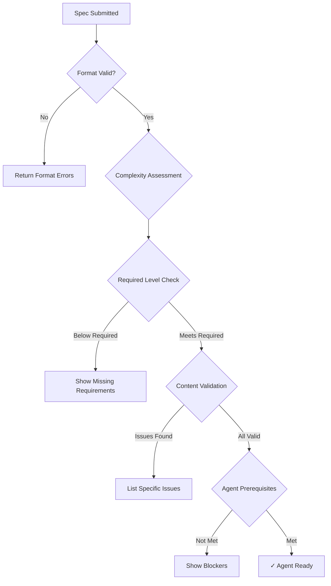

# Validation Rules for Spec-MAS

## Overview
These rules ensure specifications meet quality standards before agents can work on them. Rules are automatically applied during specification creation and review.

## Core Validation Rules

### 1. Completeness Rules

#### Level-Based Requirements
```javascript
const validationRules = {
  level1: {
    required: [
      'userStories',      // Min 1, Max 5
      'acceptanceCriteria', // Min 5, Max 20
      'successMetrics'    // Min 1, Max 3
    ],
    optional: ['background', 'assumptions']
  },
  level2: {
    required: [
      'technicalConstraints', // Min 3
      'integrationPoints',    // Min 1 if integrations exist
      'dataModels'           // Required if data is handled
    ],
    optional: ['apiContracts', 'dependencies']
  },
  level3: {
    required: [
      'errorScenarios',      // Min 3, Max 10
      'performanceRequirements', // Must include metrics
      'securityConsiderations'  // Min 2
    ],
    optional: ['loadRequirements', 'caching']
  },
  level4: {
    required: [
      'architecturePatterns',  // Min 1
      'complianceRequirements', // If regulated industry
      'observability'         // Metrics, logs, alerts
    ],
    optional: ['deploymentStrategy', 'scaling']
  },
  level5: {
    required: [
      'concreteExamples',    // Min 2, Max 5
      'counterExamples',     // Min 2
      'edgeCases',          // Min 3
      'migrationStrategy'    // Required for breaking changes
    ],
    optional: ['rollbackPlan', 'featureFlags']
  }
};
```

### 2. Content Quality Rules

#### Measurability Requirements
All requirements must be measurable. Forbidden vague terms:
- ❌ "fast" → ✅ "response time < 200ms"
- ❌ "user-friendly" → ✅ "completes in 3 clicks or less"
- ❌ "scalable" → ✅ "supports 1000 concurrent users"
- ❌ "secure" → ✅ "implements OAuth 2.0 with PKCE"
- ❌ "reliable" → ✅ "99.9% uptime"

#### Testability Requirements
Every acceptance criterion must be testable:
```markdown
❌ BAD: "System should handle errors gracefully"
✅ GOOD: "When API returns 500, display 'Service temporarily unavailable' message"

❌ BAD: "Page should load quickly"
✅ GOOD: "Page load time should be < 3 seconds on 3G connection"
```

### 3. Complexity-Based Rules

#### Complexity Determination
```javascript
function determineComplexity(spec) {
  const easyIndicators = [
    'CRUD', 'form', 'list', 'display', 'basic', 
    'simple', 'UI', 'style', 'validation'
  ];
  
  const moderateIndicators = [
    'integration', 'workflow', 'API', 'process',
    'calculate', 'transform', 'report', 'dashboard',
    'multi-step', 'notification'
  ];
  
  const highIndicators = [
    'security', 'authentication', 'architecture',
    'performance', 'real-time', 'compliance',
    'encryption', 'distributed', 'migration',
    'payment', 'healthcare', 'financial'
  ];
  
  // Check in order of complexity
  if (hasAnyIndicator(spec, highIndicators)) return 'HIGH';
  if (hasAnyIndicator(spec, moderateIndicators)) return 'MODERATE';
  return 'EASY';
}
```

#### Required Level by Complexity
```javascript
const requiredLevels = {
  'EASY': 3,      // Level 3 minimum
  'MODERATE': 4,  // Level 4 minimum  
  'HIGH': 5       // Level 5 minimum
};
```

### 4. Format Validation

#### User Story Format
```regex
Pattern: /^As a .+, I want .+, so that .+$/
```
- Must start with "As a"
- Must contain "I want"
- Must contain "so that"
- Must identify actor, action, and benefit

#### Acceptance Criteria Format
```regex
Pattern: /^Given .+, [Ww]hen .+, [Tt]hen .+$/
```
- Must start with "Given"
- Must contain "When" or "when"
- Must contain "Then" or "then"
- Must be binary (pass/fail)

#### Performance Requirements Format
Must include:
- Metric name
- Target value
- Percentile (p50, p95, p99)
- Conditions

Example: "API response time < 200ms at p95 under normal load"

### 5. Consistency Rules

#### Cross-Reference Validation
- Every integration point must have error handling
- Every external API must have timeout specified
- Every data model must have validation rules
- Every security consideration must have implementation approach

#### Terminology Consistency
- Use consistent naming throughout spec
- Define acronyms on first use
- Use same entity names as existing codebase
- Reference existing patterns by exact name

### 6. Security Validation

#### Required Security Checks
For any feature handling user data:
- [ ] Input validation specified
- [ ] Output encoding defined
- [ ] Authentication requirements clear
- [ ] Authorization rules defined
- [ ] Audit logging requirements stated

For features with external integrations:
- [ ] API key/secret management approach
- [ ] TLS/SSL requirements
- [ ] Rate limiting defined
- [ ] Timeout values specified

### 7. Agent-Specific Rules

#### Prerequisites for Agent Work
```javascript
function canAgentsWork(spec) {
  const checks = {
    hasRequiredLevel: spec.level >= requiredLevels[spec.complexity],
    noAmbiguousTerms: !hasVagueTerms(spec),
    allCriteriaMeasurable: allMeasurable(spec.acceptanceCriteria),
    errorHandlingDefined: spec.errorScenarios?.length >= 3,
    performanceDefined: hasNumericTargets(spec.performanceRequirements),
    integrationsClear: spec.integrationPoints?.every(i => i.documented)
  };
  
  return Object.values(checks).every(check => check === true);
}
```

#### Forbidden Patterns for Agents
Agents cannot work on specs containing:
- "To be determined" (TBD)
- "To be decided" (TBD)
- "Figure out the best way"
- "Use your judgment"
- "Something like"
- "Approximately"
- Question marks in requirements

### 8. Example Validation

#### Examples Must Include
- Realistic data (not foo/bar)
- Complete request/response cycles
- Error cases alongside success cases
- Actual values, not placeholders

```javascript
// ❌ BAD Example
{
  "name": "string",
  "value": "number"
}

// ✅ GOOD Example
{
  "name": "John Smith",
  "value": 99.95
}
```

### 9. Progressive Validation

#### Level Progression Rules
- Cannot skip levels
- Previous level must be 100% complete
- Each level builds on previous
- Quality > Speed

#### Validation Checkpoint
Before progressing to next level:
```javascript
function canProgressToNextLevel(spec, currentLevel) {
  const validations = {
    allRequiredFieldsComplete: checkRequiredFields(spec, currentLevel),
    noPlaceholders: !hasPlaceholders(spec),
    examplesProvided: hasExamples(spec, currentLevel),
    measurable: allMeasurable(spec),
    consistent: checkConsistency(spec)
  };
  
  const issues = Object.entries(validations)
    .filter(([_, valid]) => !valid)
    .map(([issue, _]) => issue);
    
  return {
    canProgress: issues.length === 0,
    blockers: issues
  };
}
```

### 10. Output Validation

#### Final Specification Must
- Be in valid Markdown format
- Include metadata header
- Have all sections clearly labeled
- Include maturity level badge
- Show completion checkmarks
- Export cleanly to Spec Kit format

#### Metadata Requirements
```yaml
---
title: Feature Name
maturity_level: 3
complexity: MODERATE
agent_ready: true
version: 1.0.0
created: 2024-10-16
updated: 2024-10-16
author: Team/Person Name
---
```

## Validation Error Messages

### Error Message Templates
```javascript
const errorMessages = {
  MISSING_USER_STORY: "At least one user story is required. Format: As a [user], I want [goal], so that [benefit]",
  
  VAGUE_REQUIREMENT: "Requirement '{requirement}' contains vague term '{term}'. Please specify measurable criteria.",
  
  UNTESTABLE_CRITERIA: "Acceptance criterion '{criterion}' cannot be tested. Rephrase with clear pass/fail conditions.",
  
  INSUFFICIENT_ERROR_SCENARIOS: "Only {count} error scenarios provided. Minimum 3 required for Level 3.",
  
  NO_PERFORMANCE_METRICS: "Performance requirements must include numeric targets (e.g., '<200ms at p95').",
  
  MISSING_EXAMPLES: "Level 5 requires 2-3 concrete examples with realistic data.",
  
  COMPLEXITY_MISMATCH: "Feature complexity is {complexity} but spec is only Level {level}. Level {required} needed.",
  
  INCOMPLETE_PREVIOUS_LEVEL: "Cannot progress to Level {next}. Level {current} is only {percent}% complete.",
  
  FORBIDDEN_PATTERN: "Specification contains '{pattern}' which is too ambiguous for agent processing.",
  
  SECURITY_RISK: "Feature handles {dataType} but missing required security consideration: {requirement}"
};
```

## Automated Validation Workflow

### Validation Pipeline


### Validation Report Format
```markdown
## Validation Report

### Summary
- **Status**: ⚠️ Not Agent-Ready
- **Complexity**: MODERATE
- **Current Level**: 3
- **Required Level**: 4
- **Validation Score**: 75/100

### ✅ Passed Checks (8)
- User stories well-formed
- Acceptance criteria testable
- Error scenarios comprehensive
- Performance metrics specific
- Security considerations present
- Data models defined
- Integration points mapped
- Examples provided

### ❌ Failed Checks (3)
1. **Missing Architecture Pattern**
   - Required for Level 4
   - Specify which patterns to follow
   
2. **No Compliance Requirements**
   - Required for regulated features
   - Add GDPR considerations
   
3. **Vague Term Found**
   - Line 47: "should be fast"
   - Replace with: "response time < 200ms"

### 🔧 Recommendations
1. Add architectural patterns section
2. Define compliance requirements
3. Replace all vague terms with metrics
4. Add observability requirements

### Next Steps
Complete Level 4 requirements to enable agent work.
Estimated time: 20-30 minutes
```
