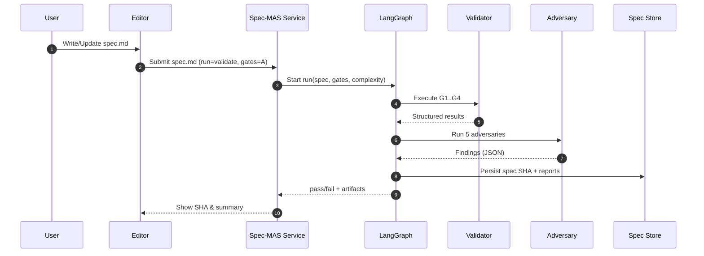
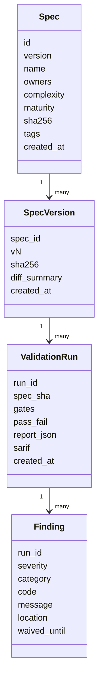

# Spec‑MAS v3 — End‑to‑End Definition
Status: Draft 2 • Date: 2025‑10‑18

This document defines **Spec‑MAS v3**, consolidating design learnings, gaps, and guidance into a single, actionable system. v3 makes **Markdown the canonical spec format**, keeps **complexity = EASY / MODERATE / HIGH** (independent of spec completeness), and **standardizes on LangGraph** as the orchestrator of record.

> **Scope note:** Spec‑MAS is a **specification and validation framework**, not a CI/CD product. Integrations can trigger validations, but Spec‑MAS itself does not provide pipeline runners or deployment logic.

---

## 0) Goals & Non‑Goals

**Goals**
- Produce a **single, coherent framework** for writing, validating, and shipping specs (independent of build/deploy tools).
- Canonicalize on **Markdown** with front‑matter metadata and structured sections.
- Separate **Complexity** (E/M/H) from **Maturity** (1–5).
- Replace ad‑hoc/grep checks with a **validator** that enforces structure, semantics, traceability, and invariants.
- Standardize orchestration on **LangGraph** with MCP as a tool access layer.

**Non‑Goals**
- Not a CI/CD tool (no pipeline runners).
- No runtime lock‑in to any LLM; Spec‑MAS specifies interfaces and gates only.

---

## 1) Canonical Authoring Contract (Markdown‑first)

Specs are authored in Markdown with a **front‑matter** block and **structured sections**. The **front‑matter** is machine‑readable; the body is human‑readable but consistently structured for parsing.

````markdown
---
specmas: v3
kind: FeatureSpec | SecurityCriticalSpec
id: <unique-id>
name: <human-readable name>
version: <semver>
owners:
  - name: <name>
    email: <email>
complexity: EASY | MODERATE | HIGH          # independent of maturity
maturity: 1 | 2 | 3 | 4 | 5                 # spec completeness
tags: [<tag1>, <tag2>]
---

# Overview
- Problem statement
- Out of scope
- Success metrics

# Functional Requirements
### FR-1: <title>
<description>
- **Validation Criteria:**
  - Given <context>, When <action>, Then <outcome>
  - ...

### FR-2: <title>
<description>
- **Validation Criteria:**
  - Given <context>, When <action>, Then <outcome>

# Non-Functional Requirements
- Performance:
- Reliability & Scalability:
- Observability:
- Compliance & Privacy:

# Data Inventory
- Data classes and PII classification (e.g., Public, Internal, Confidential, Restricted)
- Data retention and deletion policy
- Data residency and transfer constraints (if any)

# Security
- Authentication:
- Authorization:
- Data handling (PII classification, retention, deletion):
- Encryption & key management (at-rest, in-transit, KMS/rotation):
- Audit & logging (coverage, retention, tamper evidence):

# Data Model
- Entities and relationships

# Interfaces & Contracts
- APIs, events, schemas (link to OpenAPI/JSON Schema where applicable)

# Deterministic Tests
```json
{"id":"DT-001","description":"<what must hold>","preconditions":"<setup>","input":"<compact example>","expected":"<deterministic output>"}
```
```json
{"id":"DT-002","description":"<what must hold>","preconditions":"<setup>","input":"<compact example>","expected":"<deterministic output>"}
```

# Acceptance Tests
### User Stories
- As a <role>, I want <capability>, so that <benefit>.

### Acceptance Criteria
- [ ] AT-1: Given <context>, When <action>, Then <outcome>
- [ ] AT-2: Given <context>, When <action>, Then <outcome>

# Traceability (optional; inferred if omitted)
- FR-1 -> AT-1, DT-001
- FR-2 -> AT-2

# Glossary & Definitions
- Define domain terms and disambiguate vague language (fast, secure, soon).

# Risks & Open Questions
- R-1: <risk>
- Q-1: <open question>
````

---

## 2) Core Taxonomies

- **Complexity**: `EASY | MODERATE | HIGH` — _How hard is the thing?_ (scope, novelty, constraints).
- **Maturity**: `1..5` — _How complete is the spec?_ (draft → production‑ready). Do **not** derive from complexity.

Policy guidance:
- Require **higher gate coverage** (see §3) at **higher complexity**.
- Require **higher maturity** before implementation, but keep it independent from complexity.

### 2.1 Maturity Rubric (Required)
Use this rubric to assign maturity consistently.

| Level | Definition | Minimum Criteria |
| --- | --- | --- |
| 1 | Draft | Overview + at least 1 FR |
| 2 | Structured | All required sections present, basic NFR/Security filled |
| 3 | Reviewable | FR validation criteria + acceptance criteria + glossary |
| 4 | Implementable | Traceability complete + deterministic tests for critical paths |
| 5 | Release-Ready | All gates pass for stated complexity + risks addressed + human decision log recorded |

---

## 3) Validation Framework

### 3.1 Default Model — Four Gates (Recommended)
This replaces grep‑based checks with structured validation across four concerns.

- **G1: Structure**
  - Front‑matter present and typed.
  - Required sections exist: Functional, Non‑Functional, Security, Tests.
- **G2: Semantics**
  - Each FR has ≥1 **validation criterion**.
  - Security section includes **authN/Z, data handling, logging, encryption**.
  - Glossary resolves ambiguous terms.
- **G3: Traceability & Coverage**
  - **FR ↔ Tests** mapping: Every FR has ≥1 Acceptance Test. Explicit traceability is optional; IDs are inferred when present (FR-1 -> AT-1).
  - Deterministic Tests exist for critical paths.
  - Non‑functional claims have measurable targets.
- **G4: Determinism & Invariants**
  - Deterministic tests produce stable, reproducible outputs.
  - Hard invariants enforced (see §3.3).

**Pass policy by complexity**
- **EASY**: must pass G1–G2 before build; G3 before merge/release decision.
- **MODERATE**: must pass G1–G3 before merge/release decision.
- **HIGH**: must pass G1–G4 before merge/release decision.

### 3.2 Alternatives (Optional)
- **Three Gates + Scorecard** (add a soft scored determinism gate).
- **Two‑Stage (Authoring vs Service‑run)** (light local checks + strict service enforcement).

### 3.3 Invariant Library (hard rules)
- **Security**: No plaintext PII at rest; at‑rest & in‑transit encryption; all writes authenticated; authorization model stated; audit trails for security‑relevant actions.
- **Quality**: Each FR has ≥1 acceptance test and traceability entry; deterministic tests for security‑critical flows; ambiguous terms must be defined in Glossary.

### 3.5 Deterministic Test Canonicalization (Required)
Deterministic tests must be reproducible across environments. The validator enforces:
- **Canonical output**: JSON output must be canonicalized (sorted keys, UTF‑8, no whitespace).
- **Stable inputs**: Inputs must include explicit locale, timezone, and randomness seeds.
- **Execution envelope**: Tests run in a pinned runtime container with fixed versions.
- **Hashing (optional)**: If hashes are used, include algorithm and canonicalization rules.

### 3.4 Validator: Interfaces & Outputs
- **CLI**: `specmas validate path/to/spec.md --gates=A --complexity=HIGH --report out.json`
- **Outputs**: JSON + SARIF with findings, invariant violations, and coverage gaps (e.g., FRs without tests).
- **Enforcement**: A **Spec‑MAS Service** (see §5) can block merges/releases by policy, but Spec‑MAS does not implement CI/CD.

---

## 4) Adversarial Review

Implement five adversaries as independent modules; run after G2 and feed G3/G4 scoring or gating:

1. **Security Adversary** — checks threat model completeness, secrets handling, and egress controls.
2. **Ambiguity Adversary** — flags vague language; prompts for glossary entries.
3. **Compliance Adversary** — checks data retention, DSRs, and audit/readiness claims.
4. **Data Adversary** — tests data model assumptions and migration/lineage notes.
5. **Implementation Adversary** — looks for feasibility gaps, failure modes, and missing SLOs.

**Output**: machine‑readable findings with severity `INFO/WARN/ERROR/CRITICAL`. CRITICAL can fail G3/G4 or require a waiver.

---

## 5) Orchestration — LangGraph (single standard)

**Decision**: **LangGraph** is the orchestrator‑of‑record for multi‑agent workflows; **MCP** is used strictly for **tool access** (no state).

### 5.1 Reference Architecture (Mermaid)

```mermaid
flowchart LR
  subgraph Clients
    Slack[Slack Bot]
    Editor[Editor Copilot]
    CLI[SpecMAS CLI]
  end

  Slack --> API[Spec‑MAS Service API]
  Editor --> API
  CLI --> API

  API -->|Start Run| LG[LangGraph Orchestrator]

  subgraph LG[LangGraph Pipeline]
    P[Parse Spec] --> V[Validator (G1..G4)]
    V --> A[Adversarial Review (5 modules)]
    A --> S[Summarize Findings]
    S --> PER[Persist Artifacts]
  end

  PER --> DB[(Spec Store)]
  PER --> AR[(Artifacts: JSON, SARIF, HTML)]
  AR --> Slack
  AR --> Editor
  AR --> CLI

  classDef store fill:#f6f6f6,stroke:#999,stroke-width:1px;
  class DB store
```

### 5.2 Workflow (Sequence)



### 5.3 Data Model (Mermaid)



### 5.4 Node I/O Contract (stable)
- **Input**: `{ spec_markdown, repo_ref?, run_id, requested_gates, complexity }`
- **Output**: `{ spec_sha, findings[], invariants[], coverage, pass_fail, artifacts: {json_report, sarif_report} }`

### 5.5 Agent Coordination Contracts (Required for Distributed Pattern)
#### 5.5.1 Report Directory Structure
```
feature/<spec-id>/
├── reports/
│   ├── requirements-agent/
│   │   └── findings.json
│   ├── architecture-agent/
│   │   └── findings.json
│   ├── dev-agent/
│   │   └── implementation.md
│   └── qa-agent/
│       └── results.json
```

#### 5.5.2 Report Schema (Minimum)
```json
{
  "agent": "qa-agent",
  "spec_id": "feat-1234",
  "run_id": "uuid",
  "status": "PASS",
  "findings": [
    {
      "severity": "ERROR",
      "requirement_id": "FR-1",
      "message": "Missing validation for acceptance criteria AT-1"
    }
  ],
  "timestamp": "ISO8601"
}
```

#### 5.5.3 State Schema and Conflict Handling
```json
{
  "run_id": "uuid",
  "spec_sha": "sha256",
  "state_version": 3,
  "locks": {
    "dev-agent": "locked"
  },
  "latest_reports": {
    "dev-agent": "reports/dev-agent/implementation.md",
    "qa-agent": "reports/qa-agent/results.json"
  },
  "conflicts": [
    {
      "agent": "dev-agent",
      "type": "state_version_mismatch",
      "detected_at": "ISO8601",
      "resolution": "redo_required"
    }
  ]
}
```
Conflict detection is based on `state_version` mismatch or overlapping file paths. The agent that writes second must rerun from the latest state snapshot.

### 5.6 Work Queue — GitHub Issues (Required)
**Decision**: All work items are created and tracked as GitHub Issues. Specs are decomposed into issues; agents implement and verify issues.

**Issue lifecycle**
- **Decompose**: Spec → Issue per task (backend, frontend, tests, docs).
- **Assign**: Issue labels select agent/tool (e.g., `agent:claude`, `agent:codex`, `agent:gemini`, `agent:deepseek`).
- **Execute**: Agent reads issue body + linked spec, performs work, and posts results to the issue.
- **Verify**: Validator agent comments with gaps or PASS.
- **Close**: Human or policy app closes when PASS + required checks complete.

**Required labels**
- `spec:<spec-id>` (source spec)
- `phase:plan|implement|verify|done`
- `agent:<tool-name>`
- `area:backend|frontend|tests|docs|ops`

**Issue template (minimum fields)**
```
Title: [spec-id] <task summary>
Spec: <link to spec>
Scope: <what to build>
Acceptance: <Given/When/Then>
Definition of Done: <checks>
Dependencies: <issue links>
```

### 5.7 Inter‑Agent Communication — Issue Comments (Required)
All inter‑agent communication occurs via GitHub issue comments using @mentions for the target agent.

**Comment protocol**
```
@agent-<tool> STATUS: <STARTED|BLOCKED|PASS|FAIL>
Context: <brief>
Findings:
- <gap or result>
Next:
- <next action or handoff>
Artifacts: <links to reports or commits>
```

### 5.8 Agent Registry & Tool Profiles (Swappable Agents)
Agents are configured via a registry and can be swapped without code changes. The registry is managed by the Web Control UI and stored in the service config.

**Agent profile fields**
- `id`, `display_name`, `provider` (claude|openai|gemini|deepseek|local)
- `tool_type` (cli|api)
- `command` or `endpoint`
- `model`, `max_tokens`, `temperature`
- `capabilities` (implement|review|test)
- `cost_rate` (per 1M tokens)
- `enabled` (bool)

**Selection policy**
- Issue label `agent:<tool>` overrides defaults.
- Web UI can set global defaults and per‑spec overrides.

### 5.5 Migration
- Inventory current flows; port to **LangGraph** using the validator node as a shared component. Deprecate any non‑LangGraph orchestrations.

---

## 6) Persistence & Audit

Minimal relational schema (logical):

- **specs**: `(id, version, name, maturity, complexity, sha256, author, created_at, source)`
- **spec_versions**: `(spec_id, vN, sha256, diff_summary, created_at)`
- **validation_runs**: `(run_id, spec_sha, gates, pass_fail, report_json, sarif, created_at)`
- **adversarial_findings**: `(run_id, severity, category, code, message, location, waived_until)`
 - **spec_bodies**: `(spec_sha, content, repo_ref, path, created_at)`
 - **work_items**: `(issue_id, spec_id, phase, agent, status, created_at, closed_at)`
 - **issue_comments**: `(issue_id, author, body, created_at)`
 - **agent_registry**: `(agent_id, provider, tool_type, model, enabled, config_json)`

Required behaviors:
- Persist **every edit** with a content hash and timestamp.
- Service replies must include the **spec SHA** and latest validation status.

---

## 7) Tooling

### 7.1 CLI
- `specmas init` — create a new spec from the v3 template.
- `specmas validate` — run G1–G4 and adversaries; emit JSON/SARIF.
- `specmas test` — execute deterministic checks (when applicable).
- `specmas import legacy.yaml > new-spec.md` — one‑time YAML importer.
- `specmas graph-run` — call the LangGraph pipeline.

**NPM Packaging**
- Publish `specmas` as an npm package with a `specmas` bin (similar to `aic`).
- Support `npx specmas` and `npm install -g specmas`.

**Agent Adapter Layer (AI-Coord Compatible)**
- Reuse ai-coord-style tool registry definitions for CLI tools (Claude/Codex/Gemini/DeepSeek).
- Persist session state in an ai-coord-compatible structure for shared visibility.

### 7.3 Web Control UI (Required for Distributed Pattern)
The Web UI provides operational visibility and agent configuration:
- **Live pipeline state**: current spec, phase, next step, ETA.
- **Issue queue**: open issues, assignees, labels, status.
- **Agent registry**: enable/disable tools, switch models (e.g., DeepSeek).
- **Artifacts**: links to reports (JSON/SARIF/traceability).
 
UI surfaces must include:
- Run timeline with phase outcomes.
- Issue‑level detail (latest agent comment, next action).
- Global alerts for failures and cost thresholds.

### 7.2 Integrations (Non‑CI/CD)
- **Repository policy app**: block merges if a run fails gates (policy lives in the app; Spec‑MAS remains agnostic).
- **Chat/Editor integrations**: Slack command or editor action sends the spec to the Service for a run and displays the artifacts.
- **Schedulers**: optional periodic re‑validation for long‑lived specs (cron/service timers).

---

## 8) Governance

- **RACI**: PM/Author (writes spec), Architect (approves complexity ≥ MODERATE and all HIGH), Security (approves SecurityCriticalSpec), QA/Testing (owns deterministic/acceptance tests mapping).
- **Waivers**: Documented per‑finding with expiry; tracked in `adversarial_findings` with `waived_until`.
- **Golden Specs**: One per complexity level that passes the default gate model; used for onboarding.
 - **Issue Policy**: All work must map to GitHub issues with labels; agents communicate via issue comments with @mentions.

---

## 9) Migration to v3

- **Authoring**: All new specs in Markdown per §1.
- **Legacy YAML**: Supported via importer: maps `apiVersion/kind/metadata/*` to front‑matter; embeds nested YAML (e.g., examples) as fenced blocks.
- **Timeline**: Freeze new YAML intake immediately; convert active specs within two sprints; deprecate YAML tooling post‑conversion.

---

## 10) Minimal Example (EASY • Maturity 3)

````markdown
---
specmas: v3
kind: FeatureSpec
id: feat-1234
name: Saved Filters
version: 0.9.0
owners:
  - name: A. Example
    email: a@example.com
complexity: EASY
maturity: 3
tags: [search, ux]
---

# Overview
Let users save search filters and re‑use them later.

# Functional Requirements
### FR-1: Save filter
Users can save current search criteria as a named filter.
- **Validation Criteria:**
  - Given an authenticated user, When they save a filter, Then the filter appears in their list.

### FR-2: Apply filter
Users can apply a saved filter.
- **Validation Criteria:**
  - Given a saved filter, When they apply it, Then results match the original criteria.

# Non-Functional Requirements
- Performance: Apply a filter in ≤ 300 ms at P95.
- Observability: Log save/apply events with user id and filter id.

# Security
- Authentication: Required to save/apply filters.
- Authorization: Users can access only their own filters.
- Data handling: Filter definitions contain no PII.
- Encryption: At rest (DB), in transit (TLS).

# Deterministic Tests
```json
{"id":"DT-001","description":"Applying a saved filter reproduces results","preconditions":"Saved filter exists","input":"filter:status=open,priority=high","expected":"results_hash:0b5c..."}
```

# Acceptance Tests
### User Stories
- As a user, I want to save filters so that I can reuse them later.

### Acceptance Criteria
- [ ] AT-1: Given an authenticated user, When they save a filter, Then it appears in their list.
- [ ] AT-2: Given a saved filter, When they apply it, Then the result set matches the original.

# Traceability
- FR-1 -> AT-1, DT-001
- FR-2 -> AT-2

# Glossary & Definitions
- PII: Personally Identifiable Information.

# Risks & Open Questions
- Risk: Filter strings grow unbounded → mitigate by size limit.
````

This example aligns with the v3 contract and passes **G1–G3** for EASY complexity.

---

## 11) Definition of Done (DoD) for v3 Adoption

- Repository contains the **v3 template** and **validator**.
- A **Spec‑MAS Service** exists that runs the **LangGraph pipeline** and exposes results via API/CLI.
- Chat/Editor clients call the same service and show **spec SHA** and pass/fail.
- At least **one golden spec per complexity** passes the required gates.
- Legacy YAML importer is available and documented.

---

**End of Spec‑MAS v3** — Canonical MD, E/M/H complexity, LangGraph orchestration, and deterministic gating.
